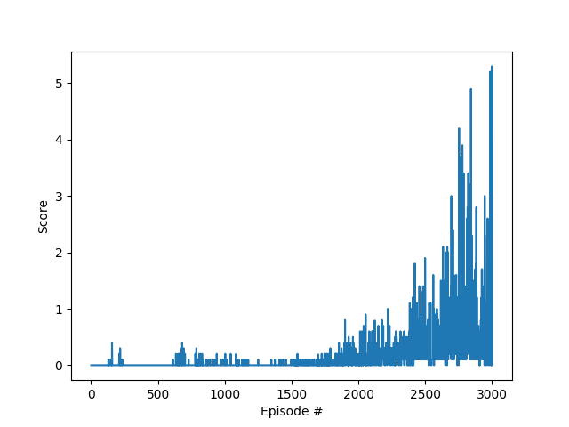

## Detail of code run with STDOUT info
```
» python maddpg.py
Found path: /home/mucho/code/DRL-Udacity-NanoDeg/collaboration-competition/./Tennis_Linux/Tennis.x86_64
Mono path[0] = '/home/mucho/code/DRL-Udacity-NanoDeg/collaboration-competition/./Tennis_Linux/Tennis_Data/Managed'
Mono config path = '/home/mucho/code/DRL-Udacity-NanoDeg/collaboration-competition/./Tennis_Linux/Tennis_Data/MonoBleedingEdge/etc'
Preloaded 'ScreenSelector.so'
Preloaded 'libgrpc_csharp_ext.x64.so'
Unable to preload the following plugins:
	ScreenSelector.so
	libgrpc_csharp_ext.x86.so
Logging to /home/rafa/.config/unity3d/Unity Technologies/Unity Environment/Player.log
INFO:unityagents:
'Academy' started successfully!
Unity Academy name: Academy
        Number of Brains: 1
        Number of External Brains : 1
        Lesson number : 0
        Reset Parameters :

Unity brain name: TennisBrain
        Number of Visual Observations (per agent): 0
        Vector Observation space type: continuous
        Vector Observation space size (per agent): 8
        Number of stacked Vector Observation: 3
        Vector Action space type: continuous
        Vector Action space size (per agent): 2
        Vector Action descriptions: ,
Episode 100	Movg Average: 0.000	Max: 0.0
Episode 200	Movg Average: 0.008	Max: 0.4
Episode 300	Movg Average: 0.008	Max: 0.4
Episode 400	Movg Average: 0.000	Max: 0.4
Episode 500	Movg Average: 0.000	Max: 0.4
Episode 600	Movg Average: 0.000	Max: 0.4
Episode 700	Movg Average: 0.023	Max: 0.4
Episode 800	Movg Average: 0.017	Max: 0.4
Episode 900	Movg Average: 0.019	Max: 0.4
Episode 1000	Movg Average: 0.009	Max: 0.4
Episode 1100	Movg Average: 0.014	Max: 0.4
Episode 1200	Movg Average: 0.010	Max: 0.4
Episode 1300	Movg Average: 0.001	Max: 0.4
Episode 1400	Movg Average: 0.004	Max: 0.4
Episode 1500	Movg Average: 0.008	Max: 0.4
Episode 1600	Movg Average: 0.016	Max: 0.4
Episode 1700	Movg Average: 0.020	Max: 0.4
Episode 1800	Movg Average: 0.049	Max: 0.4
Episode 1900	Movg Average: 0.080	Max: 0.8
Episode 2000	Movg Average: 0.115	Max: 0.8
Episode 2100	Movg Average: 0.137	Max: 0.9
Episode 2200	Movg Average: 0.145	Max: 0.9
Episode 2300	Movg Average: 0.185	Max: 1.0
Episode 2400	Movg Average: 0.234	Max: 1.1
 83%|█████████████████████████████████████████████████████████████████████████████████████████████▉                   | 2494/3000 [18:06<09:49,  1.17s/it]Episode 2500	Movg Average: 0.359	Max: 1.9
Episode 2600	Movg Average: 0.274	Max: 1.9
Episode 2700	Movg Average: 0.455	Max: 3.0
 90%|█████████████████████████████████████████████████████████████████████████████████████████████████████▉           | 2706/3000 [23:37<08:45,  1.79s/it]
Env solved in 2607 episodes!	Average Score: 0.50
 92%|███████████████████████████████████████████████████████████████████████████████████████████████████████▋         | 2752/3000 [25:08<09:48,  2.37s/it]Got higher score!
Episode 2653	Average Score: 0.58
Episode 2800	Movg Average: 0.764	Max: 4.2
 95%|███████████████████████████████████████████████████████████████████████████████████████████████████████████      | 2841/3000 [30:31<09:04,  3.42s/it]Got higher score!
Episode 2742	Average Score: 0.96
Episode 2900	Movg Average: 0.767	Max: 4.9
100%|████████████████████████████████████████████████████████████████████████████████████████████████████████████████▍| 2985/3000 [36:37<01:25,  5.68s/it]Got higher score!
Episode 2886	Average Score: 0.64
100%|████████████████████████████████████████████████████████████████████████████████████████████████████████████████▌| 2987/3000 [36:56<01:27,  6.77s/it]Got higher score!
Episode 2888	Average Score: 0.69
100%|████████████████████████████████████████████████████████████████████████████████████████████████████████████████▊| 2996/3000 [37:23<00:05,  1.35s/it]Got higher score!
Episode 2897	Average Score: 0.75
100%|████████████████████████████████████████████████████████████████████████████████████████████████████████████████▉| 2997/3000 [37:40<00:18,  6.06s/it]Got higher score!
Episode 2898	Average Score: 0.80
Episode 3000	Movg Average: 0.841	Max: 5.3
100%|█████████████████████████████████████████████████████████████████████████████████████████████████████████████████| 3000/3000 [38:50<00:00,  1.29it/s]
```
