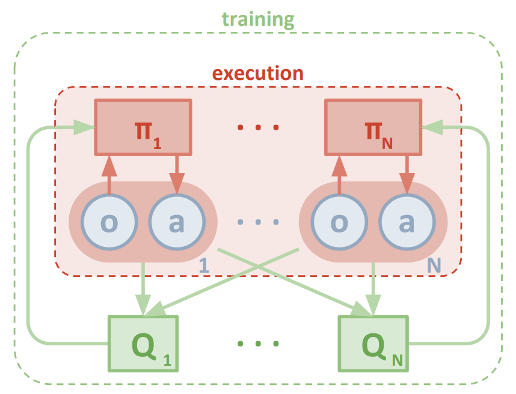

# Solving the Tennis environment with Multi-Agent Deep Deterministic Policy Gradient
### DDPG

> Image from the Lowe and Wu paper

The base for this project is the [DDPG algorith](https://arxiv.org/pdf/1509.02971.pdf) which is presented by their authors as "a model-free, off-policy actor-critic algorithm using deep function approximators that can learn policies in high-dimensional, continuous action spaces". The research from that paper has been the foundation for the last couple of projects and the prefect ground for implementing the multi-agent algorithm as exposed in [Multi-Agent Actor-Critic for Mixed Cooperative-Competitive Environments](https://papers.nips.cc/paper/7217-multi-agent-actor-critic-for-mixed-cooperative-competitive-environments.pdf). Both those papers make a perfect path to settle the knowledge adquired in the last couple of months. Please see below for more details.

# Learning Algorithm
I started this project using the code base I wrote for the Continuous Control project in which I implemented `single angent DDPG`. I combined that with the code from the [ddpg-pendulum](https://github.com/udacity/deep-reinforcement-learning/tree/master/ddpg-pendulum) repository and then sclaled it up to a multi-agent algorithm based on the [Multi-Agent Actor-Critic for Mixed Cooperative-Competitive Environments](https://papers.nips.cc/paper/7217-multi-agent-actor-critic-for-mixed-cooperative-competitive-environments.pdf) paper by Lowe and Wu. I continued the same aproach of levetraging local and target networks as implemented in the previous project with an Actor-Critic network ditribution. Where again, the Actor uses a `policy based approach` and estimates the `optimal policy` and maximases the reward through `Gradien Ascent`. The Critic on the other hand estimates the `cumulative reward` using a `value based approach`. The idea here is to minimase the number of training episodes while maximising the `reward`.
As we did in the `Continuious Control project`, we implement the `Ornstein-Uhlenbeck` noise class to avoid uding random uniform sampling and potentially get the agent stuck continuosly.

### Hyperparameters
Please see below a detail table with all the hyperparameter values.
The values below have been set based on many experiments with various results; many of those valeus have had to be modified multiple time in order to achieve the best compromise between performance and stability. In some particular sections of the code, like for instance the `Ornstein-Uhlenbeck` class, only the `sigma` hyperparameter has had to be tuned, leaving the other two untouched during the experiments performed. Another one I trusted to be corect was the `Replay Buffer size`, it tends to be a really common value and the compromise between enough random samples and convergence speed has been justified here as well. The rest have all been tuned several times and I reached the conclusion that the velues int he table below provide consistent results. One particular aspect that proved difficult in this project was the difficulty to find a good value combination to promote exploration without hidering exploitation to the point of catastrophic collapse duting training or failure to converge at all. The `Ornstein-Uhlenbeck sigma` value tuned by epsilon has been fundamental in being able to find the correct combination. Seting `epsilon` too small or `epsilon` too large would result in never converging. Another important factor was the `Neural Netowrk` architecture; it turns out that an `Actor` network with hidden layer larger than the ones chosen would not be of any benefit while the `Critic` network would require the number of neurons per layer set below as a minimum. The number of episodes required to converge are typically large in my implementation, usually above 1500 episodes, but using the hyperparameters shown below that seems to be of minor importance because training runs quite fast. I was able to train the agent to convergence in less than 20 minutes using a laptop.

| Hyperparameter | Value |
|---|---:|
| Replay buffer size | 1e6 |
| Batch size | 256 |
| Actor hidden units | 100, 100 |
| Critic hidden units | 260, 140 |
| Actor learning rate | 3e-4 |
| Critic learning rate | 6e-4 |
| Tau | 1e-3 |
| Gamma | 0.99 |
| Ornstein-Uhlenbeck, mu | 0 |
| Ornstein-Uhlenbeck, theta | 0.15 |
| Ornstein-Uhlenbeck, sigma | 0.1 |
| Num episodes | 3000 |
| Epsilion start | 1.0 |
| Epsilon end | 0.001 |
| Epsilon decay | 0.999 |

# Plot of Rewards


### Detail of code run with STDOUT info
```
» python maddpg.py
Found path: /home/mucho/code/DRL-Udacity-NanoDeg/collaboration-competition/./Tennis_Linux/Tennis.x86_64
Mono path[0] = '/home/mucho/code/DRL-Udacity-NanoDeg/collaboration-competition/./Tennis_Linux/Tennis_Data/Managed'
Mono config path = '/home/mucho/code/DRL-Udacity-NanoDeg/collaboration-competition/./Tennis_Linux/Tennis_Data/MonoBleedingEdge/etc'
Preloaded 'ScreenSelector.so'
Preloaded 'libgrpc_csharp_ext.x64.so'
Unable to preload the following plugins:
	ScreenSelector.so
	libgrpc_csharp_ext.x86.so
Logging to /home/rafa/.config/unity3d/Unity Technologies/Unity Environment/Player.log
INFO:unityagents:
'Academy' started successfully!
Unity Academy name: Academy
        Number of Brains: 1
        Number of External Brains : 1
        Lesson number : 0
        Reset Parameters :

Unity brain name: TennisBrain
        Number of Visual Observations (per agent): 0
        Vector Observation space type: continuous
        Vector Observation space size (per agent): 8
        Number of stacked Vector Observation: 3
        Vector Action space type: continuous
        Vector Action space size (per agent): 2
        Vector Action descriptions: ,
Episode 100	Movg Average: 0.001	Max: 0.1
Episode 200	Movg Average: 0.001	Max: 0.1
Episode 300	Movg Average: 0.002	Max: 0.1
Episode 400	Movg Average: 0.009	Max: 0.2
Episode 500	Movg Average: 0.017	Max: 0.3
Episode 600	Movg Average: 0.017	Max: 0.3
Episode 700	Movg Average: 0.019	Max: 0.3
Episode 800	Movg Average: 0.021	Max: 0.3
Episode 900	Movg Average: 0.003	Max: 0.3
Episode 1000	Movg Average: 0.009	Max: 0.3
Episode 1100	Movg Average: 0.019	Max: 0.3
Episode 1200	Movg Average: 0.060	Max: 0.3
Episode 1300	Movg Average: 0.096	Max: 0.4
Episode 1400	Movg Average: 0.104	Max: 0.4
Episode 1500	Movg Average: 0.133	Max: 0.8
Episode 1600	Movg Average: 0.129	Max: 0.8
Episode 1700	Movg Average: 0.383	Max: 2.5
 57%|███████████████████████████████████████████████████████████████▏                                               | 1708/3000 [12:50<1:12:39,  3.37s/it]
Env solved in 1609 episodes!	Average Score: 0.51
 57%|████████████████████████████████████████████████████████████████▊                                                | 1722/3000 [13:20<37:59,  1.78s/it]
Got higher score!
Episode 1623	Average Score: 0.56
 57%|███████████████████████████████████████████████████████████████▊                                               | 1724/3000 [13:40<2:01:12,  5.70s/it]
Got higher score!
Episode 1625	Average Score: 0.63
Episode 1800	Movg Average: 0.718	Max: 5.2
 62%|█████████████████████████████████████████████████████████████████████▊                                           | 1854/3000 [17:36<17:43,  1.08it/s]
```

# Ideas for Future Work
